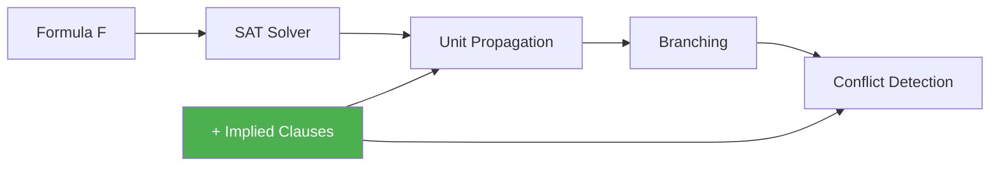
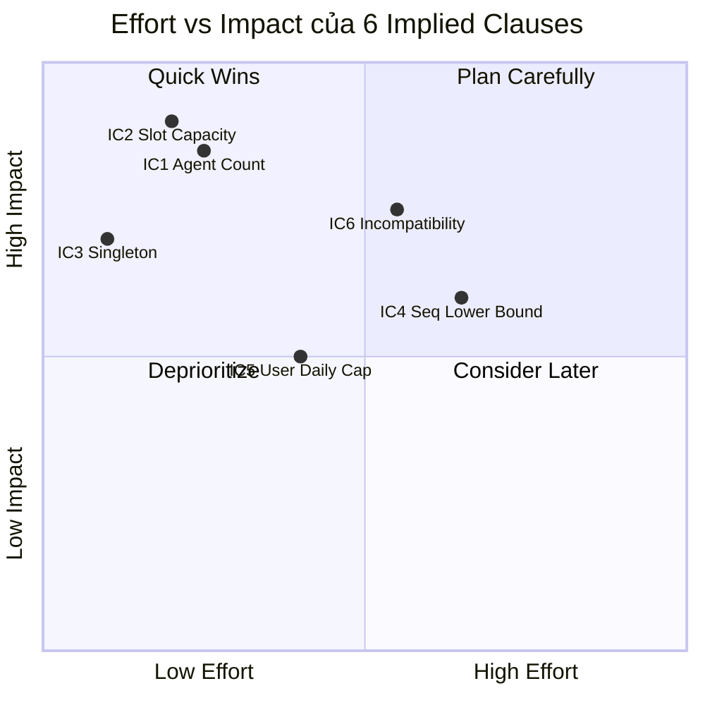

# Implied Clauses cho bài toán HCORAP — Kỹ thuật Pruning Search Space

> **Tham khảo chính**: Bofill, Coll, Giráldez-Cru, Suy & Villaret (2022). *"The Impact of Implied Constraints on MaxSAT B2B Instances"*. International Journal of Computational Intelligence Systems, 15(63).
> DOI: [10.1007/s44196-022-00121-5](https://doi.org/10.1007/s44196-022-00121-5)

---

## 1. Implied Clause là gì?

### Định nghĩa

**Implied clause** (ràng buộc hàm ý / ràng buộc dư thừa) là clause được **suy ra logic** từ các constraint đã có trong formula:

$$F \models C \quad \Rightarrow \quad C \text{ là implied clause của } F$$

> [!IMPORTANT]
> Implied clause **không thay đổi tập nghiệm** — mọi nghiệm thỏa mãn F cũng tự động thỏa mãn C. Nhưng việc thêm C vào F giúp solver **phát hiện xung đột sớm hơn**, dẫn đến tăng tốc đáng kể.

### Tại sao hiệu quả?



| Cơ chế | Giải thích |
|--------|-----------|
| **Unit Propagation mạnh hơn** | Thêm clause → nhiều literal bị force true/false sớm hơn → ít branching |
| **Conflict sớm hơn** | Solver nhận ra nhánh infeasible nhanh hơn → prune nhiều hơn |
| **Heuristic tốt hơn** | CDCL solver tăng activity cho biến trong implied constraints → branching hiệu quả hơn |

### Kết quả từ Bofill et al. 2022

Trong bài toán B2B Scheduling (cùng nhóm tác giả với HCORAP), 2 implied constraints được xác định:

1. **imp1** — Ràng buộc đếm meeting mỗi participant:
   - Số slot sử dụng của participant p **phải bằng** số meeting p tham gia
   - Hiệu quả khi **mật độ thấp** (ít meeting so với capacity)

2. **imp2** — Ràng buộc capacity toàn cục:
   - Tổng participant có meeting ở mỗi slot ≤ 2 × |Locations|
   - Hiệu quả khi **mật độ cao**

**Kết quả**: Sử dụng **cả hai** implied constraints (imp12) luôn tốt hơn, giảm thời gian giải **đến hàng bậc magnitude**.

---

## 2. Áp dụng cho HCORAP

### 2.1 Nhắc lại cấu trúc encoding HCORAP

**Biến chính:**
- $x_{a,s,h}$: agent $a$ làm service $s$ tại slot $h$
- $y_{a,s}$: agent $a$ được giao service $s$ (∃h)
- $su_{s,h}$: service $s$ được thực hiện tại slot $h$
- $ss_{a,q}$: agent $a$ tham gia sequence $q$
- $w_{a,i}$: agent $a$ được giao ≥ $i$ services
- $c_{q,i}$: sequence $q$ có ≥ $i$ agent khác nhau

**Hard constraints:** C7–C14 (AMO, coverage, availability, qualification, max hours)

**Soft constraints:** Similarity (Eq.19), Stability (Eq.20), Cost (Eq.22)

### 2.2 Sáu Implied Clauses đề xuất cho HCORAP

---

#### **IC1: Agent Service Count Consistency** ⭐⭐⭐⭐⭐ `[X] ĐÃ CÀI ĐẶT`
*Tương tự imp1 của Bofill (participant meeting count)*

**Ý tưởng**: Nếu agent $a$ có khả năng làm tối đa $K_a$ services (do availability + qualification), thì:

$$\sum_{s \in \{1..S\}} y_{a,s} \leq K_a \quad \forall a$$

trong đó $K_a = |\{s : r(a,s) > 0 \land \exists h: TSA(a,h) \land TSS(s,h)\}|$

**Nhưng** ta đã có ràng buộc max hours (Eq.14): $\neg w_{a,m}$ với $m = HN(a) + HE(a) + 1$. IC1 **bổ sung** bằng cách tính $K_a$ chặt hơn:

$$K_a = \min\big(HN(a) + HE(a),\; |\{s : (a,s) \in \text{valid\_pairs}\}|\big)$$

**Clause CNF:**
```
atMost(K_a, {y_{a,s} | r(a,s) > 0})    ∀a ∈ {1..A}
```

**Tại sao implied?** — Đây là hệ quả logic của AMO constraint (Eq.9) kết hợp với agent availability (Eq.11).

**Code đề xuất** (thêm vào `_encode_hard` trong `hcorap_encoding.py`):
```python
# IC1: Agent service count upper bound
for a in range(inst.A):
    valid_services = [s for s in range(inst.S) if (a, s) in self.y]
    avail_slots = sum(1 for t in range(inst.TS) if inst.TSA[a][t])
    # Agent can do at most min(max_hours, available_slots, #valid_services) services
    tight_bound = min(inst.HN[a] + inst.HE[a], avail_slots, len(valid_services))
    y_vars = [self.y[(a, s)] for s in valid_services]
    if len(y_vars) > tight_bound:
        self._add_atmost(y_vars, tight_bound)  # Tighter than Eq.14
```

---

#### **IC2: Time Slot Capacity Bound** ⭐⭐⭐⭐⭐ `[X] ĐÃ CÀI ĐẶT`
*Tương tự imp2 của Bofill (capacity-based slot bound)*

**Ý tưởng**: Tại mỗi slot $h$, tổng số service được thực hiện bị giới hạn bởi số agent có sẵn:

$$\sum_{s \in \{1..S\}} su_{s,h} \leq |\{a : TSA(a,h) = 1\}| \quad \forall h \in \{1..TS\}$$

**Clause CNF:**
```
atMost(available_agents_h, {su_{s,h} | TSS(s,h) = 1})    ∀h
```

**Tại sao implied?** — Mỗi service cần đúng 1 agent (Eq.7+8), mỗi agent làm tối đa 1 service/slot (Eq.9). Vậy số service/slot ≤ số agent khả dụng.

**Code đề xuất:**
```python
# IC2: Per-slot service capacity
for t in range(inst.TS):
    avail_agents = sum(1 for a in range(inst.A) if inst.TSA[a][t])
    z_vars = [self.z[(s, t)] for s in range(inst.S) if (s, t) in self.z]
    if len(z_vars) > avail_agents:
        self._add_atmost(z_vars, avail_agents)
```

---

#### **IC3: Service Feasibility Pruning** ⭐⭐⭐⭐ `[X] ĐÃ CÀI ĐẶT`
*Mới — đặc thù cho HCORAP*

**Ý tưởng**: Nếu service $s$ chỉ có thể được làm bởi **đúng 1 agent** duy nhất $a^*$, thì bắt buộc $y_{a^*,s} = 1$:

$$|\{a : r(a,s) > 0 \land \exists h: TSA(a,h) \land TSS(s,h)\}| = 1 \Rightarrow y_{a^*,s}$$

**Clause CNF:**
```
(y_{a*,s})    for all s where only one agent can do it
```

**Tại sao implied?** — Service $s$ phải được thực hiện (Eq.8). Nếu chỉ có 1 agent đủ điều kiện, kết quả là bắt buộc.

**Code đề xuất:**
```python
# IC3: Force singleton feasible assignments
for s in range(inst.S):
    feasible_agents = [a for a in range(inst.A) if (a, s) in self.y]
    if len(feasible_agents) == 1:
        self._add_hard([self.y[(feasible_agents[0], s)]])
```

---

#### **IC4: Sequence Agent Lower Bound** ⭐⭐⭐
*Mới — liên kết stability với coverage*

**Ý tưởng**: Mỗi sequence $q$ có $|SEQ(q)|$ services. Vì mỗi agent làm tối đa 1 service/slot, số agent tối thiểu cho sequence $q$ phụ thuộc vào **overlap time slots**:

Nếu $k$ services trong sequence $q$ chỉ khả thi ở cùng 1 time slot $h$, thì cần ≥ $k$ agent khác nhau:

$$c_{q,k} \quad \text{(phải true nếu k services overlap)}$$

**Clause CNF:**
```
(c_{q,k})    if k services in SEQ(q) can only be done at the same slot
```

**Code đề xuất:**
```python
# IC4: Sequence minimum agent count from time slot overlap
for q, seq in enumerate(inst.SEQ):
    for t in range(inst.TS):
        # Count services in this sequence that MUST use slot t
        must_use_t = []
        for s in seq:
            feasible_slots = [h for h in range(inst.TS) if inst.TSS[s][h]]
            if feasible_slots == [t]:
                must_use_t.append(s)
        if len(must_use_t) > 1:
            # At least len(must_use_t) distinct agents needed
            # → c_{q, len(must_use_t)} must be true
            pass  # Force via sorting network output
```

---

#### **IC5: User Daily Capacity** ⭐⭐⭐
*Mới — tương tác giữa user service count và time slots*

**Ý tưởng**: Số service của user $i$ trong 1 ngày $d$ bị giới hạn bởi số slot khả dụng trong ngày đó:

$$\sum_{s \in SU(i)} \sum_{h \in \text{day}(d)} su_{s,h} \leq |\text{slots\_in\_day}(d)| \quad \forall i, d$$

Nhưng kết hợp với AMO constraint (Eq.10), ta có ràng buộc chặt hơn: tại mỗi slot tối đa 1 service/user.

**Clause CNF:**
```
atMost(slots_per_day, {su_{s,h} | s ∈ SU(i), h ∈ day(d)})    ∀i, ∀d
```

---

#### **IC6: Agent-Service Incompatibility Propagation** ⭐⭐⭐ `[X] ĐÃ CÀI ĐẶT`
*Mới — kết hợp nhiều constraint*

**Ý tưởng**: Nếu giao agent $a$ cho service $s_1$ → agent $a$ **không thể** làm service $s_2$ (vì overlap time), thì:

$$y_{a,s_1} \land (\text{all feasible slots of } s_1 \text{ and } s_2 \text{ overlap}) \Rightarrow \neg y_{a,s_2}$$

**Clause CNF:**
```
(¬y_{a,s₁} ∨ ¬y_{a,s₂})    if all feasible (a,s₁,h) and (a,s₂,h') have h=h'
```

**Code đề xuất:**
```python
# IC6: Pairwise service incompatibility for same agent
for a in range(inst.A):
    services_a = [s for s in range(inst.S) if (a, s) in self.y]
    for i, s1 in enumerate(services_a):
        slots_s1 = {t for t in range(inst.TS) if (a, s1, t) in self.x}
        for s2 in services_a[i+1:]:
            slots_s2 = {t for t in range(inst.TS) if (a, s2, t) in self.x}
            # If all feasible slots overlap → incompatible
            if slots_s1 == slots_s2 and len(slots_s1) == 1:
                self._add_hard([-self.y[(a, s1)], -self.y[(a, s2)]])
```

---

## 3. Phân loại theo tác động dự kiến



| IC | Tên | Analog Bofill | Effort | Impact dự kiến |
|----|-----|--------------|--------|----------------|
| **IC1** | Agent Service Count | imp1 (participant count) | Thấp | ⭐⭐⭐⭐⭐ |
| **IC2** | Time Slot Capacity | imp2 (location capacity) | Thấp | ⭐⭐⭐⭐⭐ |
| **IC3** | Singleton Feasibility | — (mới) | Rất thấp | ⭐⭐⭐⭐ |
| **IC4** | Sequence Agent LB | — (mới) | TB | ⭐⭐⭐ |
| **IC5** | User Daily Capacity | — (mới) | TB | ⭐⭐⭐ |
| **IC6** | Incompatibility Prop | — (mới) | TB | ⭐⭐⭐ |

---

## 4. Thiết kế thí nghiệm đề xuất

Theo phương pháp luận Bofill et al. 2022:

### 4.1 Các configuration cần test

| Config | Ý nghĩa |
|--------|---------|
| `noimp` | Encoding gốc (không implied clause) |
| `ic12` | IC1 + IC2 (analog Bofill) |
| `ic123` | IC1 + IC2 + IC3 |
| `ic_all` | Tất cả 6 implied clauses |

### 4.2 Metrics cần đo

- **Solving time** (avg, median, PAR1, PAR10)
- **#Solved instances** trong timeout 1h
- **#Variables** và **#Clauses** (encoding size)
- **#Decisions** và **#Conflicts** của solver
- **Branching variable distribution** (% decisions trên IC vars)

### 4.3 Instance parameters cần thay đổi

| Parameter | Giá trị | Analog Bofill |
|-----------|---------|---------------|
| **Density** = S / (A × TS_avg) | Low, Medium, High | density $d$ |
| **Agent/Service ratio** = A / S | 0.05, 0.10, 0.15 | shape $s$ |
| **Qualification sparsity** = avg(r > 0) / (A×S) | 0.3, 0.5, 0.7 | — |

### 4.4 Dự đoán (hypotheses)

> [!TIP]
> Dựa trên pattern Bofill et al.:

1. **IC1** hiệu quả hơn khi **agent ít** (A nhỏ, density cao) — tương tự imp1 + low density
2. **IC2** hiệu quả hơn khi **time slot ít** (TS nhỏ) — tương tự imp2 + low shape
3. **IC3** hiệu quả nhất khi **qualification sparse** (nhiều r(a,s)=0) — nhiều singleton
4. **ic_all luôn tốt hơn noimp** — consistent với kết luận Bofill

---

## 5. Tài liệu tham khảo

1. **Bofill, Coll, Giráldez-Cru, Suy & Villaret** (2022). *The Impact of Implied Constraints on MaxSAT B2B Instances*. IJCIS 15(63). — **Paper chính về implied constraints**

2. **Bofill, Coll, Garcia, Giráldez-Cru, Pesant, Suy & Villaret** (2022). *Constraint solving approaches to the business-to-business meeting scheduling problem*. JAIR 74, 263–301. — **Paper gốc B2B encoding**

3. **Unceta, Salbanya, Coll, Villaret & Nin** (2025). *Optimizing resource allocation in home care services using MaxSAT*. — **Paper HCORAP gốc**

4. **Alsinet, Béjar, Cabiscol, Fernández & Manyà** (2002). *Minimal and redundant SAT encodings for the all-interval-series problem*. CCIA. — **Lý thuyết nền tảng về redundant encoding**

5. **Kautz, Ruan, Achlioptas, Gomes, Selman & Stickel** (2001). *Balance and filtering in structured satisfiable problems*. IJCAI. — **Filtering và implied constraints tổng quát**
